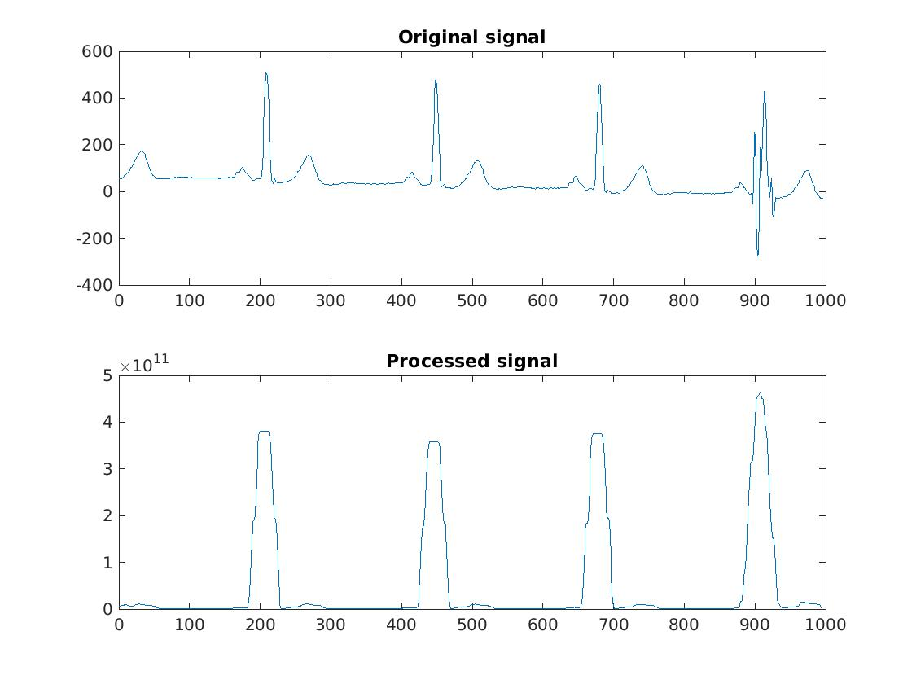

# A Moving Average based Real-time Filtering System for QRS Detection

# Abstract
We implemented a moving average based filtering
system based on Chen-Chen detector [1] , which can
detect QRS complexes in real-time. We then propose
improvements to this baseline algorithm. Here we
implemented a more robust preprocessing of the original
signal as proposed in Pan-Tompkins detector [2] . To
reduce the amount of false positive detections, we
introduce some additional restrictions in the decision
making. All versions of detectors were tested on both
LTST [3] and MIT/BIH [4] databases and the porposed
improvements have show to have beneficial effect on the
results.

# Results

| Name            | Se (LTST)          | +P (LTSLT)            | Se (MIT/BIH)            | +P (MIT/BIH)            |
|-----------------|--------------|----------------|----------------|----------------|
| Original        | 96.14        | 88.48          | 96.84          | 83.92          |
| Preprocess      | **97.20** | 82.53          | **99.68** | 77.44          |
| Min200          | 96.15        | **99.34** | 97.25          | 98.97          |
| PrepMin200      | 97.12        | 98.85          | 99.59          | 99.58          |
| PrepMin200TWave | 96.89        | 98.91          | 99.39          | **99.62** |

# Instructions for running detector on whole database
- Have a folder named "ltstDB" or "mitbihDB" where all files from the database are stored
- For every signal file in the database generate .mat file
- Change Fs (sampling frequency) in "Detector.m" (250 for ltstDB, 360 for mitbihDB)
- Comment/Uncomment parts of QRSDetect.m to run different version of the detector
- In Matlab run "runDetector.m" with a parameter which specifiec a database you would like to use ("ltstDB" or "mitbihDB")
- Put run_detector.sh inside folder where your results are
- Run run_detector.sh with with optional parameter whicih specific name of resulting .txt file

# Reference
[1] H. Chen and S. Chen, “A moving average based filtering
system with its application to real-time QRS detection,” in
Computers in Cardiology, 2003, IEEE, 2003.
[2] J. Pan and W. J. Tompkins, “A real-time QRS
detection algorithm,” IEEE Transactions on Biomedical
Engineering, vol. BME-32, pp. 230–236, Mar. 1985.[3] F. Jager, A. Taddei, G. B. Moody, M. Emdin, G. Antolič,
R. Dorn, A. Smrdel, C. Marchesi, and R. G. Mark,
“Long-term ST database: A reference for the development
and evaluation of automated ischaemia detectors and for
the study of the dynamics of myocardial ischaemia,”
Medical & Biological Engineering & Computing, vol. 41,
pp. 172–182, Mar. 2003.
[4] G. Moody and R. Mark, “The impact of the MIT-BIH
arrhythmia database,” IEEE Engineering in Medicine and
Biology Magazine, vol. 20, no. 3, pp. 45–50, 2001.
[5] A. L. Goldberger, L. A. N. Amaral, L. Glass, J. M.
Hausdorff, P. C. Ivanov, R. G. Mark, J. E. Mietus, G. B.
Moody, C.-K. Peng, and H. E. Stanley, “PhysioBank,
PhysioToolkit, and PhysioNet,” Circulation, vol. 101,
June 2000.